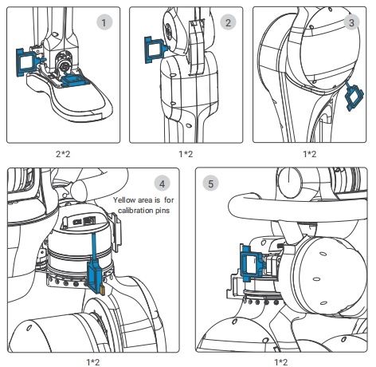
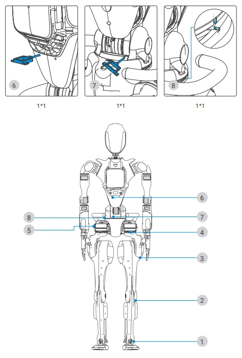

# Calibration Procedure

If the upper limb posture appears abnormal or if the motors have been replaced, you should perform zero calibration. The calibration procedure is as follows:

- Turn off the robot actuators and the embedded robot computer.
- Insert the calibration tool into the robot's lower limbs and waist joint pinholes. There are `6*2` zero-position pinholes in the lower limbs and `3*1` zero-position pinholes in the waist.

   
   

- Connect the embedded robot computer to a monitor through the extension dock. Plug in a keyboard and a mouse into the extension dock as well.
- Release the Emergency Stop switch and power on the embedded robot computer. The login password is `fftai2015`.
